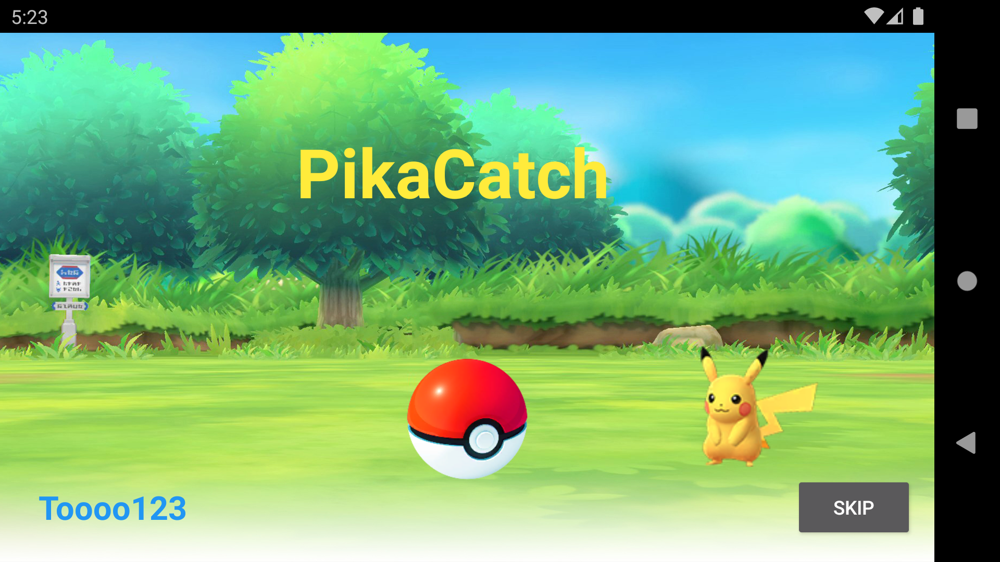
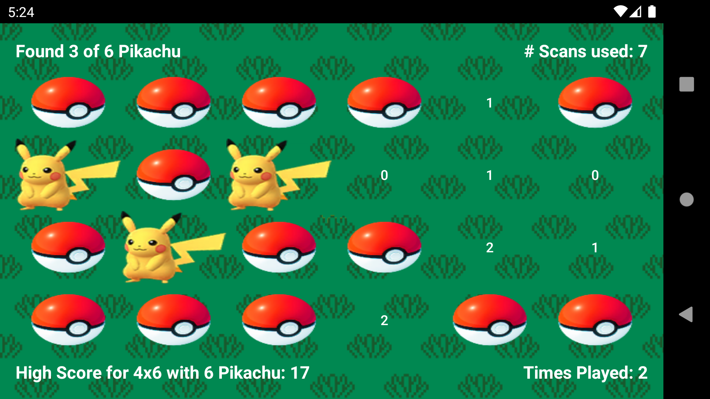
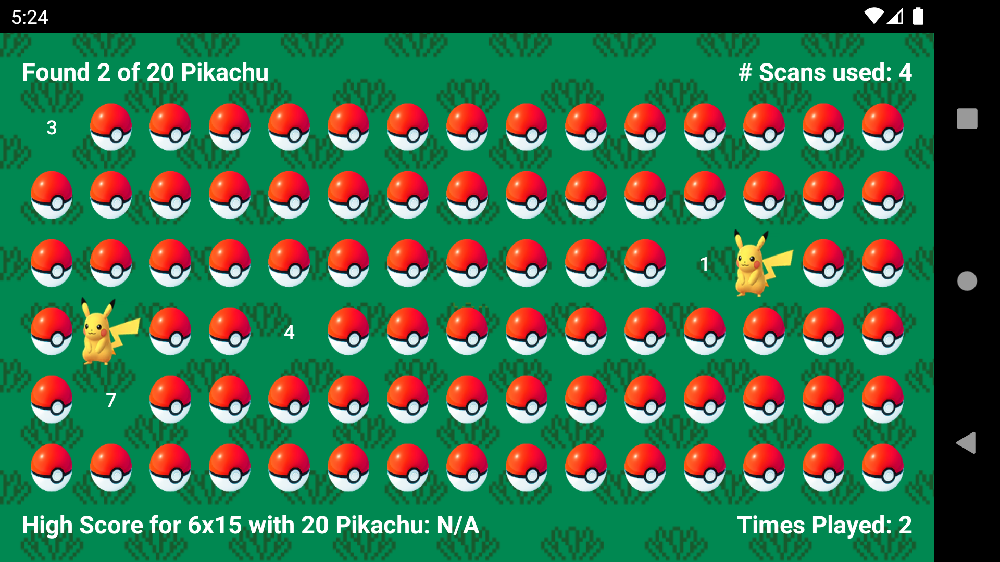

# PikaCatch (Android)
<p align='center'>
  
</p>

Find all the Pikachus hiding in the Poké Balls.
Open fewer Poké Balls to obtain a higher score.
Play in a range of board sizes and Pikachu count.

## Installation
1. Download, install, and run [Android Studios](https://developer.android.com/studio)
2. Click "Get From Version Control"
3. Insert the following URL:
```
https://github.com/Toooo123/PikaCatch-Android.git
```
4. Run app on either an Android Emulator or your phone plugged into your computer

## How to Play?
PikaCatch is a game where the player tries to find all the Pikachu hiding in the Poke Balls.
A given amount of Pikachu will hide in a set amount of Poke Balls and both can be changed in the options.
The player can open the Poke Ball, either revealing a Pikachu or a number.
This number shows the amount of hidden Pikachu in same row and column.
The objective of the game is to find all the Pikachu with the fewest number of scans.

## Features
- Fun and animated welcome screen
- Play with four different board and four different Pikachu count
- Save highscores for each gameboard and Pikachu count

## Screenshots
<table>
  <tr>
    <td>  </td>
    <td>  </td>
  </tr>
  <tr>
    <td> Welcome Screen </td>
    <td> Home Screen </td>
  </tr>
</table>

<table>
  <tr>
    <td>  </td>
    <td>  </td>
  </tr>
  <tr>
    <td> 4x6 Board </td>
    <td> 6x15 Board </td>
  </tr>
</table>

## Resources
- [Pokemon Go](https://pokemongolive.com/en/)
- [Emma2727 Deviant Art](https://www.deviantart.com/emma2727)
- [Let's Go Pikachu](https://pokemonletsgo.pokemon.com/en-ca)
- [Hat_Boy Threadless](https://www.threadless.com/@Hat_Boy)
- [Anonymous](https://archive.nyafuu.org/vp/thread/30398319/)
- [Caveman](https://wallpapercave.com/electric-pokemon-wallpapers)
